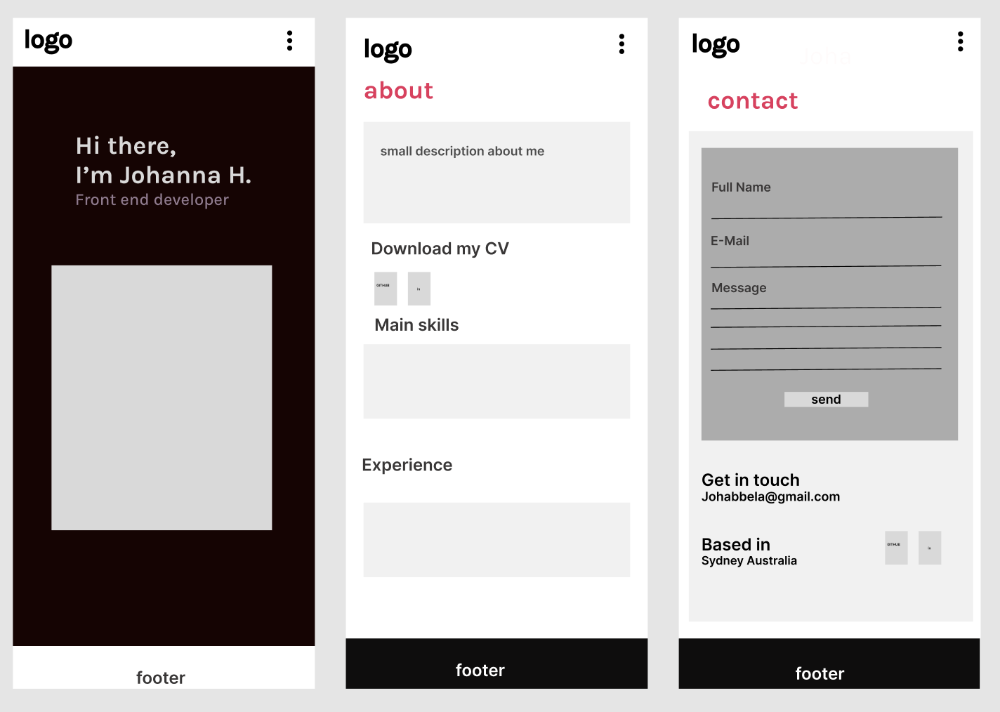
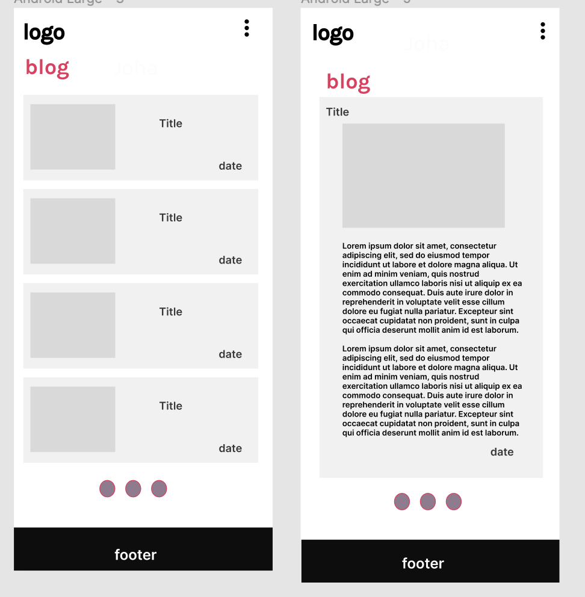
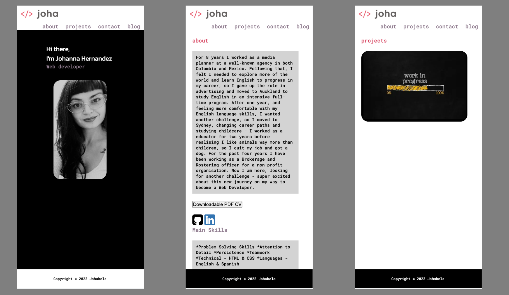
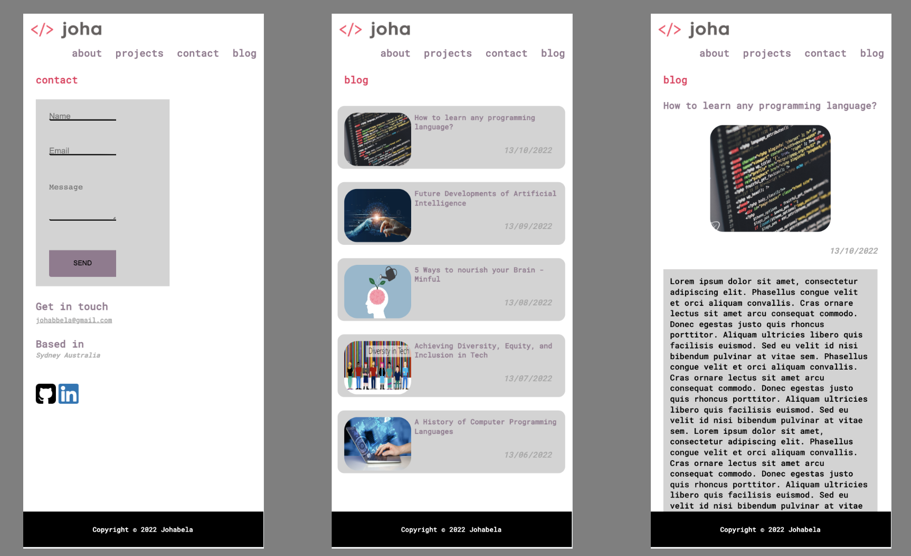
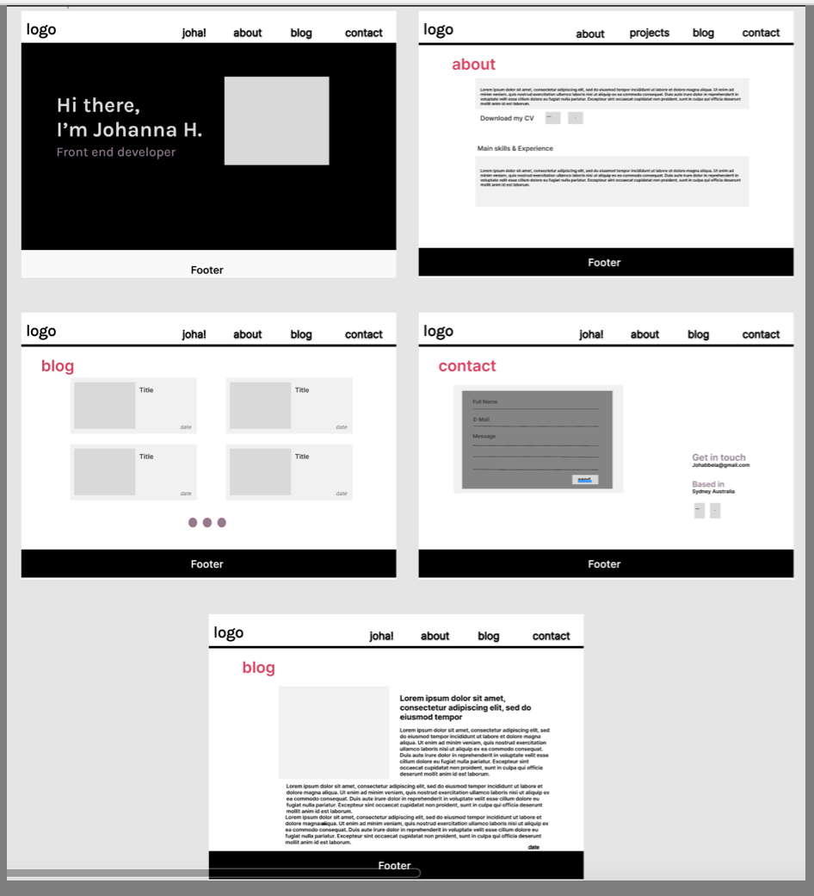
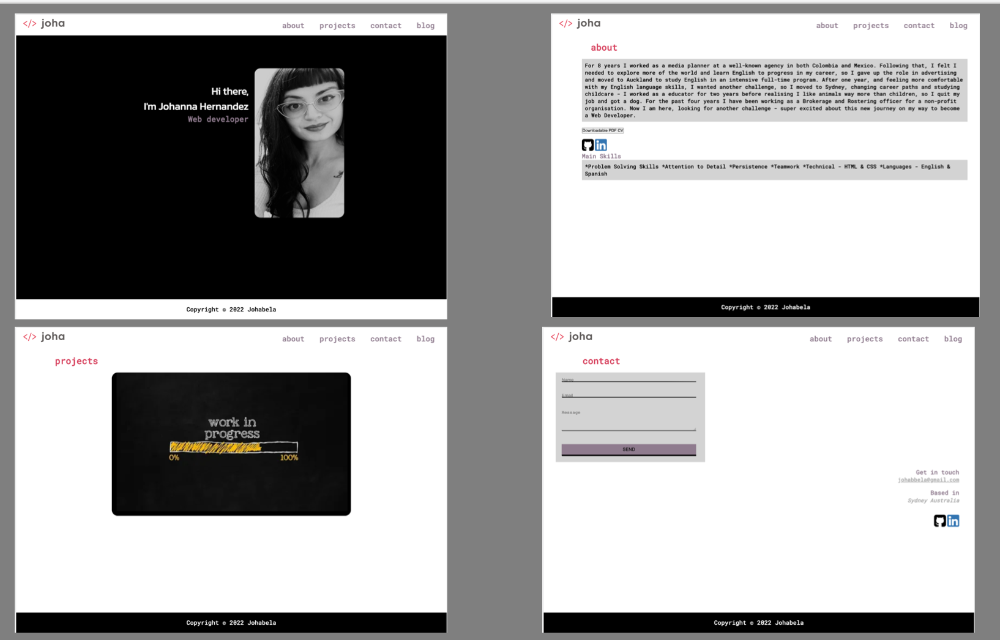
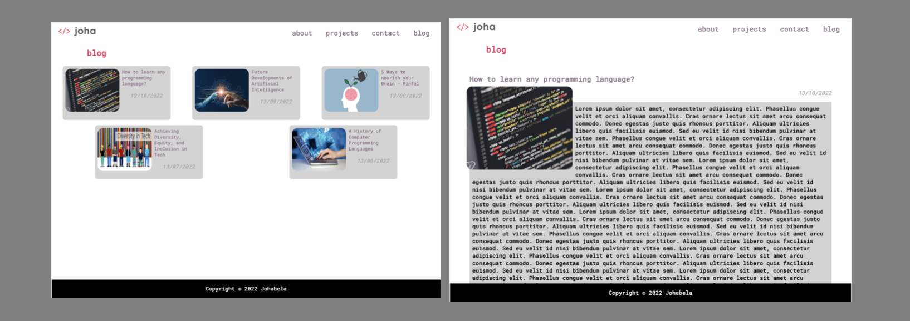
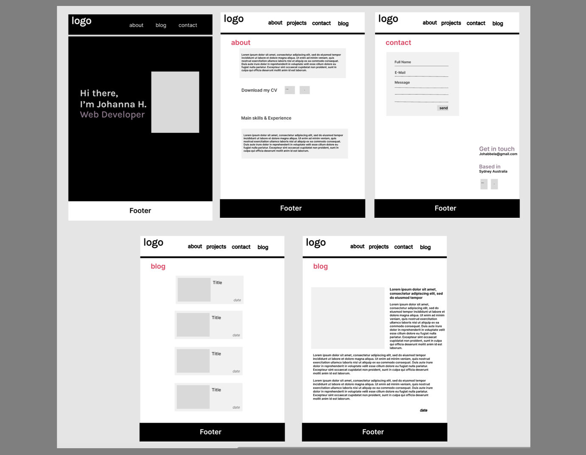
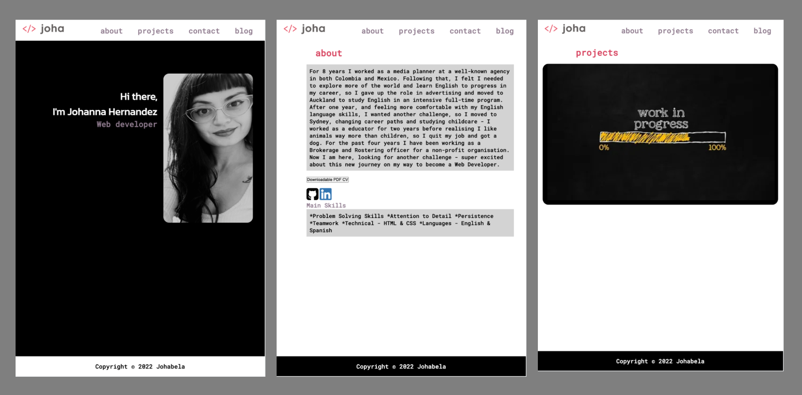
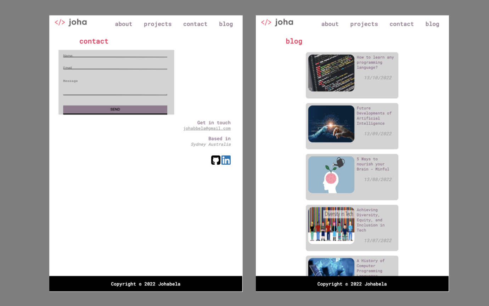

# Johanna's Portafolio 

https://johannah-portfolio.netlify.app

https://github.com/Johabela/portafolio_joha

https://www.figma.com/file/z4qUvjYCi3NelKEffg2E8d/Johanna-H-Portfolio?node-id=108%3A287

## Description

This portfolio is a project website to show my skills/abilities,learning process and development on the application of the different coding and programming languages. 

This is a static website built using HTML and CSS - *flex-box*. 

My primary target audience is future employers looking for a web developer.

## SITEMAP

The website will start with the follwing four sections, features and content:

1. Home
    - **Navigation bar** will be shown across the entire website. 

    - **The Logo** is re-used across the website and is clickable, taking the users to the homepage.

    -**Photo** of me. 
    

2. About 
    - **Content with information about me**, showing my professional history, skills and story. 

    - Users will be able to download my cv by clicking the button **Downloadable PDF CV**  
    
    - **Icons** with their links to my profesional accounts **Github** and **LinkedIn**. 

3. Projects 
    - Page in progress. I will be showing my work on this page once I have started to build. At the moment there is only an image. 

4. Contact
    - **Contact Form** styling done, users will be able to send messages using this feature. Pending to work on the back-end. 

    - In addition, the is an option for users to email directly by clicking on **my email** on the contact **Get in touch**.

    - Content informing where I am currently **Based**. 

    - **Icons** with their links to my profesional accounts **Github** and **LinkedIn**. 

5. Blog 
     - There are **five tech-related articles** displayed with their *images*, *titles* and *published date*.

6. Blog Article 
     - There are **five pages** showing each article with their *image*, *text-content* and *published date*. 

## Mobile 

- Mobile View Mockups 

- Mobile View Portfolio 

## Desktop 

- Desktop View Mockups 

- Desktop View Portfolio 

## Tablet 

- Tablet View Mockups 

- Tablet View Portfolio

